# Introduction

HotMeals application is an example food ordering application

# Initial requirements

Write an application for Food Delivery

- User must be able to create an account and log in. (If a mobile application, this means that more users can use the app from the same phone).
- Implement 2 roles with different permission levels
- * Regular User: Can see all restaurants and place orders from them
- * Restaurant Owner: Can CRUD restaurants and meals
- A Restaurant should have a name and description of the type of food they serve
- A meal should have a name, description, and price
- Orders consist of a list of meals, date, total amount and status
- An Order should be placed for a single Restaurant only, but it can have multiple meals
- Restaurant Owners and Regular Users can change the Order Status respecting below flow and permissions:
- * Placed: Once a Regular user places an Order
- * Canceled: If the Regular User cancel the Order
- * Processing: Once the Restaurant Owner starts to make the meals
- * In Route: Once the meal is finished and Restaurant Owner marks it’s on the way
- * Delivered: Once the Restaurant Owner receives information that the meal was delivered by their staff
- * Received: Once the Regular User receives the meal and marks it as Received
- Status should follow the sequence as stated above, and not allowed to move back
- Status can not be changed by a different user than is stated above
- Orders should have a history about the date and time of the status changing
- Both Regular Users and Restaurant Owners should be able to see a list of the orders

- Restaurant Owners have the ability to block a User
- REST/GraphQL API. Make it possible to perform all user actions via the API, including authentication (If a mobile application and you don’t know how to create your own backend you can use Firebase.com or similar services to create the API).
- In any case, you should be able to explain how a REST/GraphQL API works and demonstrate that by creating functional tests that use the REST/GraphQL Layer directly. Please be prepared to use REST/GraphQL clients like Postman, cURL, etc. for this purpose.
- If it’s a web application, it must be a single-page application. All actions need to be done client-side using AJAX, refreshing the page is not acceptable. (If a mobile application, disregard this).
- Functional UI/UX design is needed. You are not required to create a unique design, however, do follow best practices to make the project as functional as possible.
- Bonus: unit and e2e tests.

# Application description

The initial requirements roughly describe the application functionality.
While the application is targeting the initial requirements I have taken a liberty of expanding some of the requirements because they seemed logical for this kind of application. For example I've added phone numbers for both the customer and restaurant as it seems logical information.
The exact and detailed functionality of the application can be best described via describing all the pages from which the application consists of.

Note: The first several screenshots display the full page, later on only the central content of the page is depicted.

## Home page (landing page)
  

This is the initial page displayed to anyone who is not logged in into the application. The user can enter the login information and login or he can register himself as either a regular customer or a restaurant owner.

### Customer - registration
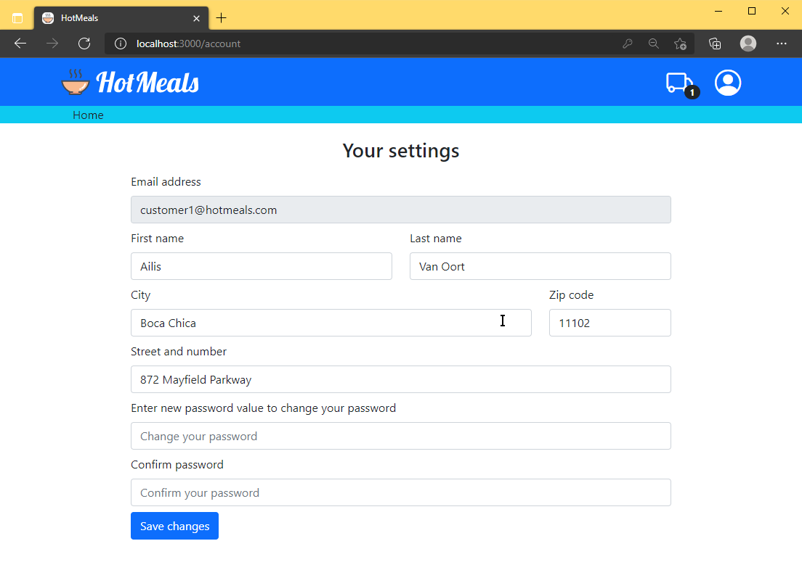  

This page is displayed when registering a new customer. The user must enter basic information to be able to be registered as a new customer.  
The entered information is validated before the user can be registered:
- All fields are mandatory
- Email address must be valid and there should not be a user with the same email registered in the application
- Password must be sufficiently complex

Note: There are no registration or verification emails sent once the registration is successful 

## Customer - home page (landing page)
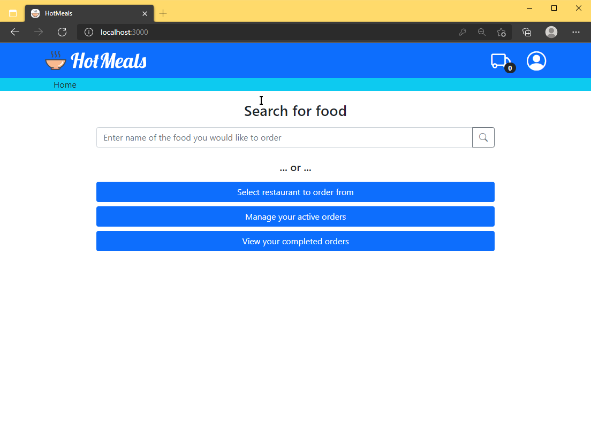   

This page is displayed as a home page for a user once the user is logged in and the user is a customer.
The user has an option to immediately search for food or to navigate to a list of restaurants for a direct selection of a restaurant from which to order.
Once the user is logged in an additional 'user' image which can be clicked to gain additional menu where the user can:
- Manage his account
- Logout

The screenshot also depicts notifications which the user may receive at any time but this is separately described later in this document.
(see [Common user experience](#common-user-experience))

## Customer - direct restaurant selection
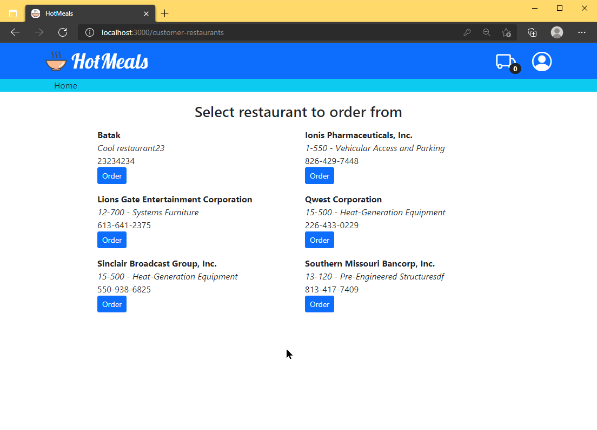

If the user wants to directly select a restaurant to order from then he is forwarded to the list of all restaurants. The user may then click on 'Place order' on any restaurant that he wants. Only restaurants with at least one menu item are displayed here.

Note: If a user is blocked by a restaurant owner then the restaurants of that owner will not be visible in this list.

## Customer - search result
   

If a customer performs a direct search then the results of the search will be displayed. All food which matches the entered text will appear in the list.
The search is a simple search where the search expression must exactly match the text within a menu item name or description (case insensitive). For example searching for 'fried chicken' will match 'Fried chicken' but not 'Chicken, fried with sauce'.

If a user select a menu item from the list then that menu item is automatically added to the current order and the list of items switches to displaying only items from the same restaurant from which the menu item in the search list was selected (see next page).

Note: If a user is blocked by a restaurant owner then the menu items from all restaurants of that owner will not be visible in this list.

## Customer - ordering food
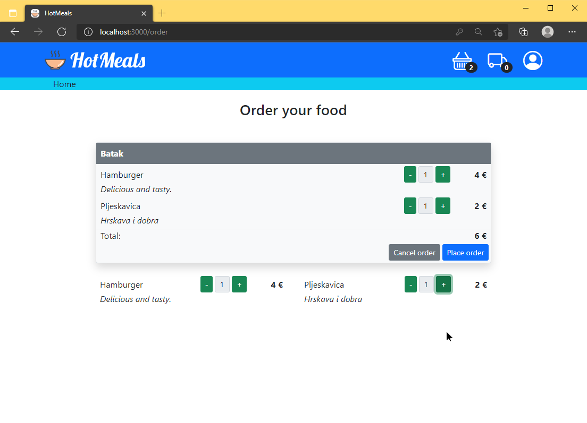   

This page is reached when customer selects a restaurant from the list of restaurants or when the customer selects a single item from the search result (see previous page). Once the user starts creating an order an additional basket icon appears in the top right corner. Clicking on this icon will bring the user to this page.

Current order is displayed on the top of the page. If the browser is near the top of the page the full order is displayed with details about all selected items, their prices and totals.
In case the user scrolls down the full order section is replaced with a smaller order section which simply details the most relevant information (menu items ordered and total price). This section also remains always on top (sticky).

Below the current order is the full menu of the restaurant with a small filter text box where the user can quickly filter only the menu items which are interesting for him.
Next to each menu item is a number input where the currently ordered number of items is visible. User can click on +- buttons to add items to current order or directly enter the number of items to order.

Note: If the user navigates away from this page the current order will be cleared and the user will need to start over in this case. Because of this the user will be asked to confirm navigating away.

After selecting the items user can click on 'Confirm order' which will bring up the order confirmation popup.
 
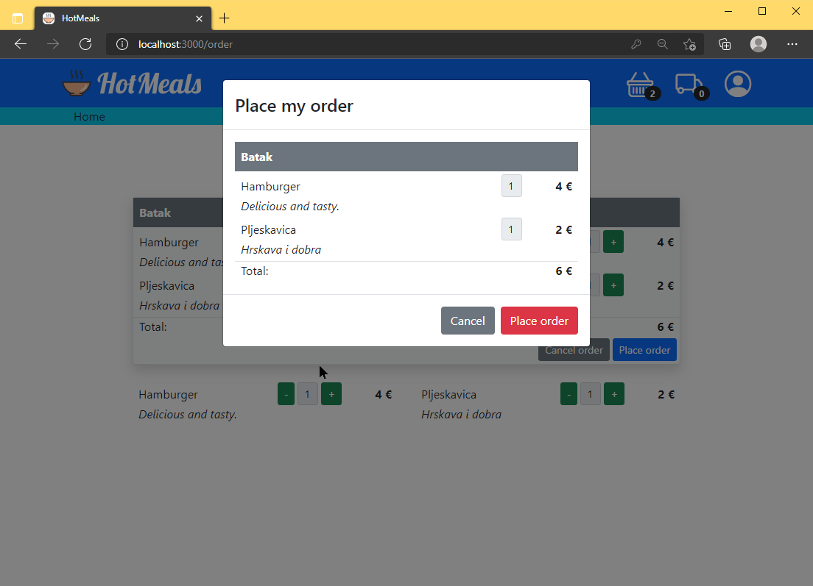   

Order confirmation is a modal dialog which displays relevant information about the order and has a button to confirm the order.
Once the button is pressed the order is placed and spinner is displayed. 
When the order is placed the restaurant owner should get notified that a new order has been placed. The restaurant owner must be logged in and using the application to be notified (see [Common user experience](#common-user-experience)).
Once the order is placed a Cancel button becomes available to the customer.
While the customer is waiting for the restaurant owner to confirm the order the user may click on 'Cancel' which will cancel the order.

Once the restaurant owner has accepted the order the modal dialog goes away.
The customer is then redirected to the his order list where he can view the current status of the order (see next page).  
The user also sees the notification icon in the top left corner which indicates that there is an active order.

## Customer - order list (active)
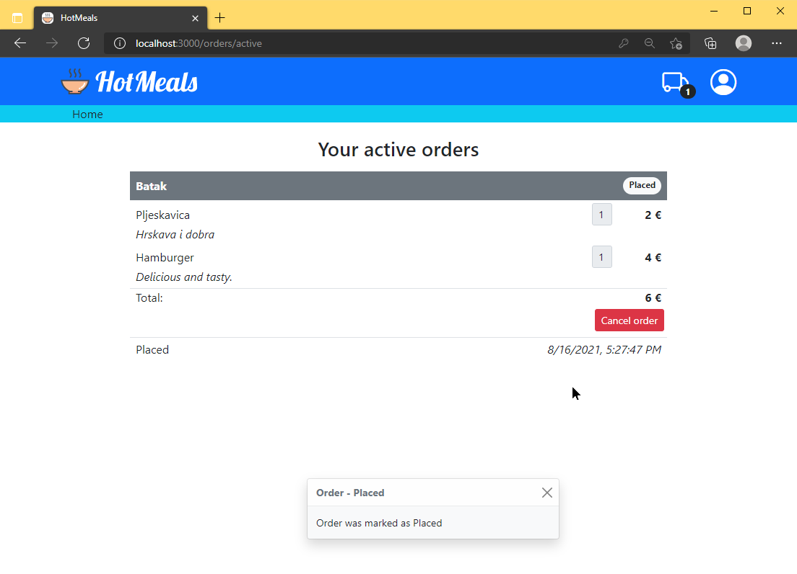   

The user can access this page from the main page or by clicking on the truck icon on the top right corner.
The user can view all relevant information about orders as well as history of status changes.
For the active orders the following buttons are available:
- Cancel - cancels the active order; only possible until the restaurant owner ships the order; once the order has been shipped it can no longer be canceled
- Received - confirms that the customer has received the order; only possible after the restaurant owner marks the order as delivered

## Customer - order list (active)
   

The user can access this page from the main page.
The user can view all relevant information about orders as well as history of status changes.
There are no actions available.

### Customer - account settings
  

This page is similar to customer registration page. Same validation settings apply, however the password and password confirmation should remain empty and should only be entered if the user wants to change the current password (the screenshot does not accurately represent the account editing).

## Restaurant owner - home page
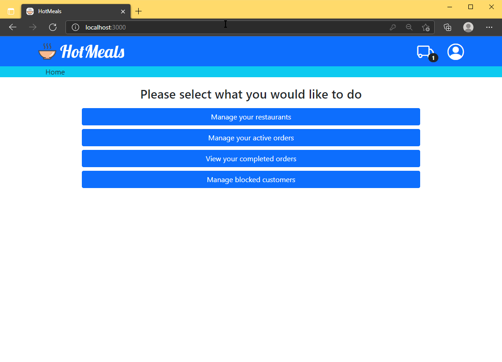   

This page is displayed as a home page for a user once the user is logged in and the user is a restaurant owner.
The user has several options:
- Manage his restaurants
- Manage active orders and view past orders
- Manage blocked customers

Once the user is logged in an additional 'user' image which can be clicked to gain additional menu where the user can:
- Manage his account
- Logout

The screenshot also depicts notifications which the user may receive at any time but this is separately described later in this document.
(see [Common user experience](#common-user-experience))

## Restaurant owner - registration
   

This page is displayed when registered as a new restaurant owner. The user must enter basic information to be able to be registered as a new user.
The entered information is validated before the user can be registered:
- All fields are mandatory
- Email address must be valid and there should not be a user with the same email registered in the application
- Password must be sufficiently complex

Note: There are no registration or verification emails sent once the registration is successful 

## Restaurant owner - restaurant list
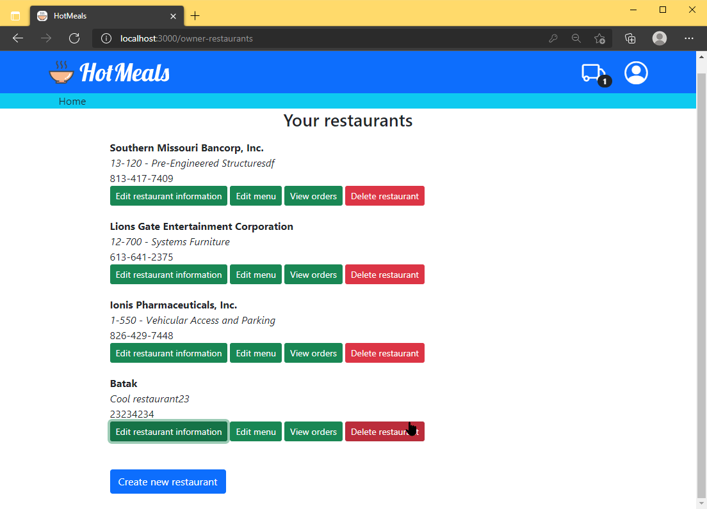   

This page is accessed from restaurant owner home page.
The page lists all restaurants owned by the restaurant owner.
For each restaurant the owner can do the following:
- Edit restaurant information (described in restaurant editing page)
- Edit restaurant menu (described in restaurant menu editing page)
- Delete the restaurant

Deletion of a restaurant will perform a hard delete (delete records from a database) in case there aren't any orders for that restaurant. In case there were orders for that restaurant then restaurant can not be deleted.
Note: The owner can still remove all menu items which will effectively hide it from the list of restaurants visible to the customers.
The user can also create a new restaurant by clicking on the 'New restaurant' button.

## Restaurant owner - restaurant editing
   

Editing a restaurant will bring up a modal dialog where the user can enter the basic information about the restaurant.
The entered information is validated:
- All fields are mandatory
- Name of the restaurant must be unique for all restaurants owned by the owner

## Restaurant owner - restaurant menu
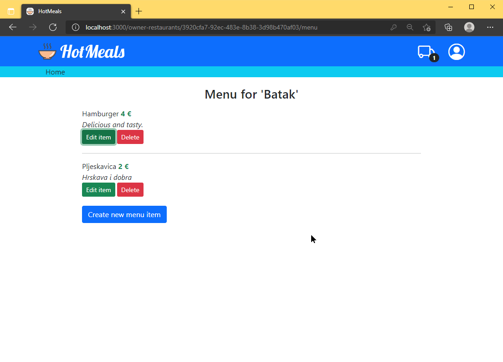   

This page is accessed when the user selects to edit a restaurant menu from the restaurant list page.
The page lists all menu items for the selected restaurant.
For each menu item the user can do the following:
- Edit menu item information (described in menu item editing page)
- Delete the menu item

The user can also create a new menu item by clicking on the 'New menu item' button.

## Restaurant owner - restaurant menu editing
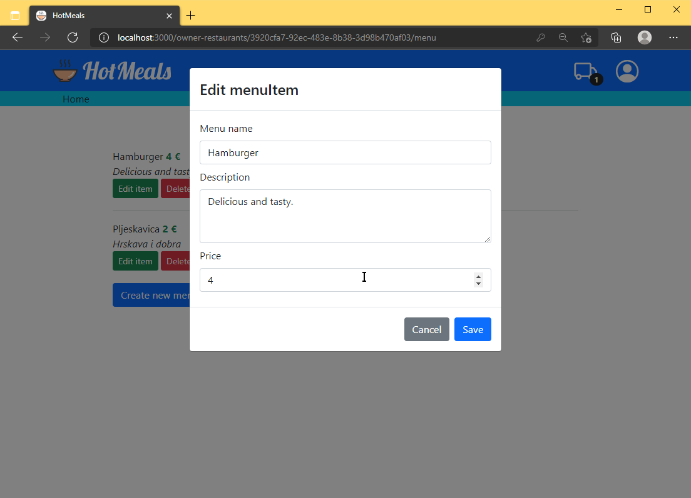   

Editing a restaurant menu item will bring up a modal dialog where the user can enter the basic information about the menu item.
The entered information is validated:
- All fields are mandatory
- Price must be a positive number with 2 decimals
- Meal name must be unique for the selected restaurant

## Restaurant owner - order list (active)
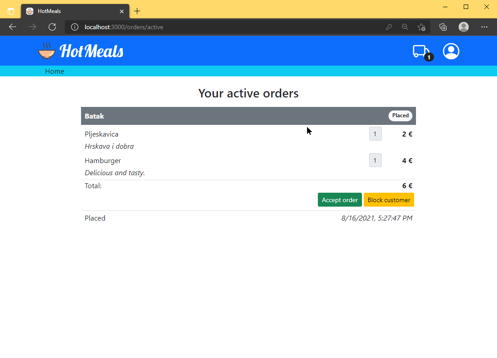   

The user can access this page from the main page or by clicking on the truck icon on the top right corner.
The user can view all relevant information about orders as well as history of status changes.
For the active orders the the following buttons are displayed depending on the status of the order:
- Accept order - confirm that the restaurant owner has accepted the order; only possible when the order is first placed by the customer
- Ship order - confirms that the order was shipped; only possible after accepting the order
- Delivered - confirms that the order was delivered to the customer; only possible after the order has been shipped

In addition to managing the order the restaurant owner has the option to block the customer that made the order. This will not block the currently active orders but it will prevent the customer from being able to view menus or place orders for any of the restaurants of the restaurant owner.

## Restaurant owner - order list (completed)
   

The user can access this page from the main page.
The user can view all relevant information about orders as well as history of status changes.
The restaurant owner has the option to block the customer that made the order. This will not block the currently active orders but it will prevent the customer from being able to view menus or place orders for any of the restaurants of the restaurant owner.

## Restaurant owner - blocked user management
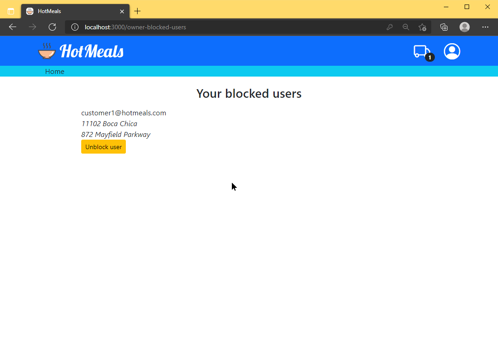   

The user can access this page from the main page. The page lists all customers which have been blocked by current restaurant owner and enables the owner to unblock a customer.

## Restaurant owner - account settings
   

This page is similar to restaurant owner registration page. Same validation settings apply, however the password and password confirmation should remain empty and should only be entered if the user wants to change the current password (the screenshot does not accurately represent the account editing).

## Common user experience
While user is logged in as a customer or restaurant owner the user may get notified about events occurring in the application. These events are raised whenever an order changes status.
For example if a user posts a new order a restaurant owner will get a notification that a new order has been received in real-time. 
In addition to this, in case there are active orders (for customer or restaurant owner) an additional truck icon appears in the top right corner. This notification icon has a badge which displays count of active orders relevant for the user. Clicking on the icon will bring up the active orders page for the user.

